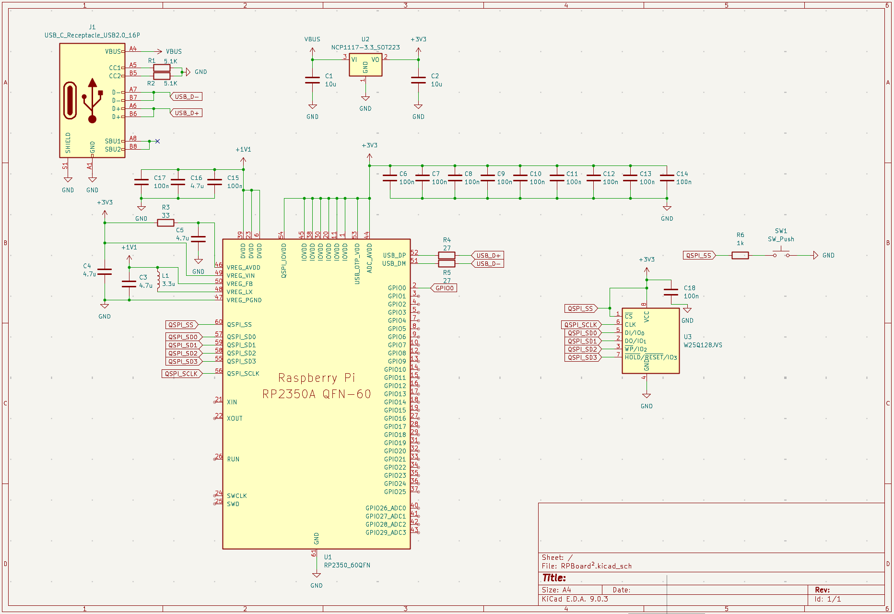
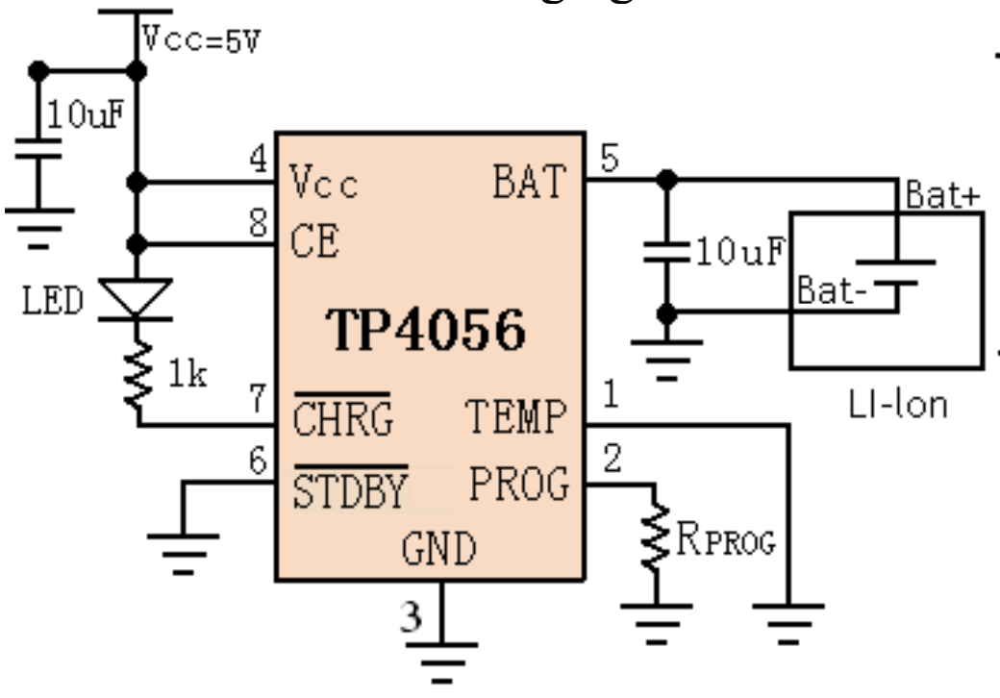
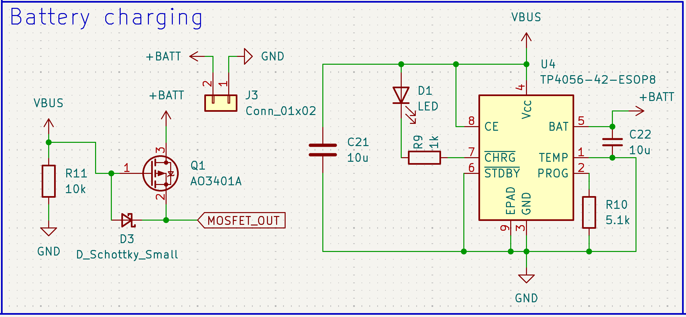
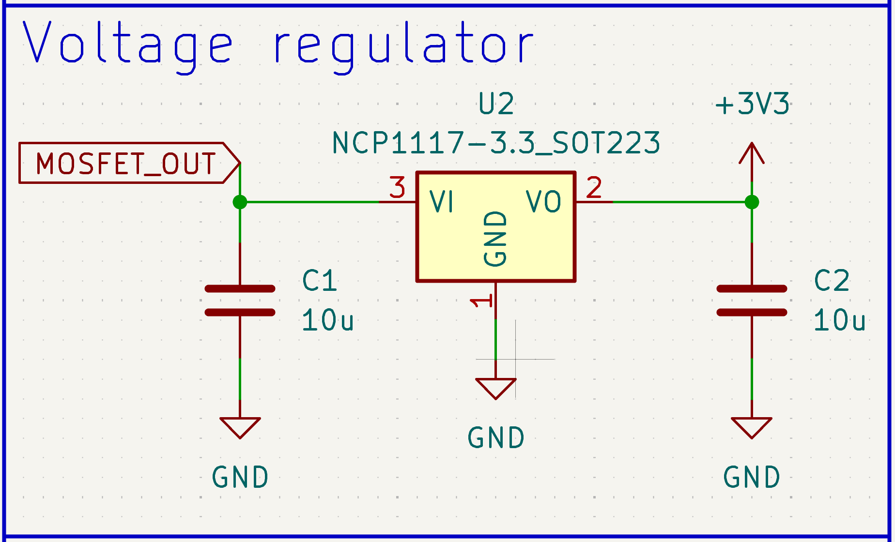
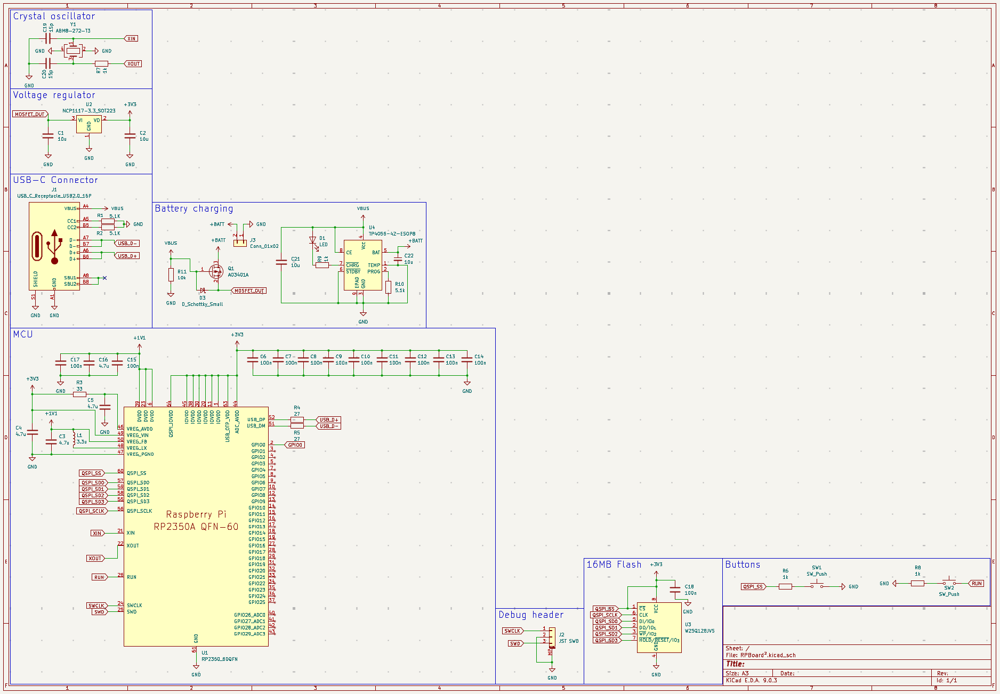

### Total time spent: 9h

# July 15: Started reading hardware design guide + basic schematic design

I wanted to get started doing the schematic as I was reading the guide instead of just reading, so that's what I did :D

Here's how my schematic is looking for now: (ik it's really basic but I'm just getting started and following the guide, I'll add a ton of features once I have the basics done. also I spent most of the time trying to understand what I'm doing instead of just copy pasting that's why it took me so long lol)

Only thing I changed for now is the USB connector for it to be USB-C, it's not really too different from the micro USB symbol but that's probably because I'm using a 16 pin connector.

As for the flash, it took me quite some time to figure out how to wire it because the guide wasn't really clear but it ended up being easier than I thought, idk why I got so confused lol

Then I also added decoupling caps on the power pins (took me some time to understand what they were and why I should add them but after quite a lot of googling I think I figured it out).

And the last thing I added to my schematic was the external components needed to make the on-chip voltage regulator work properly, I copied that from the guide since I didn't want to mess up and for some reason the guide really insists on using a specific inductor so might as well do that lmao

To finish with the basics of the schematic I'm only missing the crystal oscillator, a debug connector (optional but I'll add it anyways for convenience) and a reset button (optional too but obviously nice to have).

As for additional features, for now I'm planning on adding lipo battery support, a Qwiic connector, a microSD card slot and maybe even a small OLED depending on how much space I have left

Well hopefully tomorrow I'll finish with the basics and start adding some actually interesting features!! :D

**Time spent this session: 4h**

# July 16: Finished basic features + lot of research into charging circuit

Today I finished the basic features needed to make the board work! It's really simple though so I don't think its worth it to even include a screenshot of that.

What I did spend a lot of time on though is trying to figure out how I'd implement battery charging into the board, and after a few hours of googling and reading datasheets I think I'm gonna use a TP4056 with its "typical application" circuit as the charging IC (screenshot below) and then use a MOSFET so load switches to VBUS when USB is plugged in. From what I've seen I also have to include a diode in the load sharing circuit for protection. I'll try to add the charging aspect tomorrow and then see if someone can take a look at my schematic and tell me if there's any mistakes, maybe I'm overthinking this too much lol

microSD card reader shouldn't be too hard to wire, and a Qwiic connector should be even easier. I'm not sure if I'll end up adding the OLED though, since I'm planning on getting PCBA for this board and also aliexpress takes like 2 months to ship to me so I wouldn't be able to build it in time unless I source it locally (in that case I'd pay the price difference between getting it locally and ali out of pocket since the cost of locally sourcing an OLED is lower than the customs fees I'd be charged with aliexpress lmao)

Hopefully this approach works because I spent a lot of time figuring it out 😭

**Time spent this session: 3h**

# July 17: Finished charging circuit + tidied up schematic

I finally finished implementing the charging circuit in my schematic, it took me way longer than it should have but I wanted to make sure I was doing everything right becasue no power = no board :(

This is how my charging circuit looks now:

The 5.1k resistor should give me a charging current of around 200-250 mA, which I think is fine for small LiPo batteries. Anyways, if I were to change my mind later I could just swap that resistor.

I also switched the voltage regulator to take in the output from the MOSFET instead of just VBUS:

Finally, I tidied up the schematic, changed the size to A3 and divided everything into sections so it's easier to read and work with:

I think tomorrow I'll be able to fully finish my schematic and maybe start with the PCB, though I'd like to get someone to take a look at it and tell me if there are any obvious mistakes before starting with the PCB

**Time spent this session: 2h**
