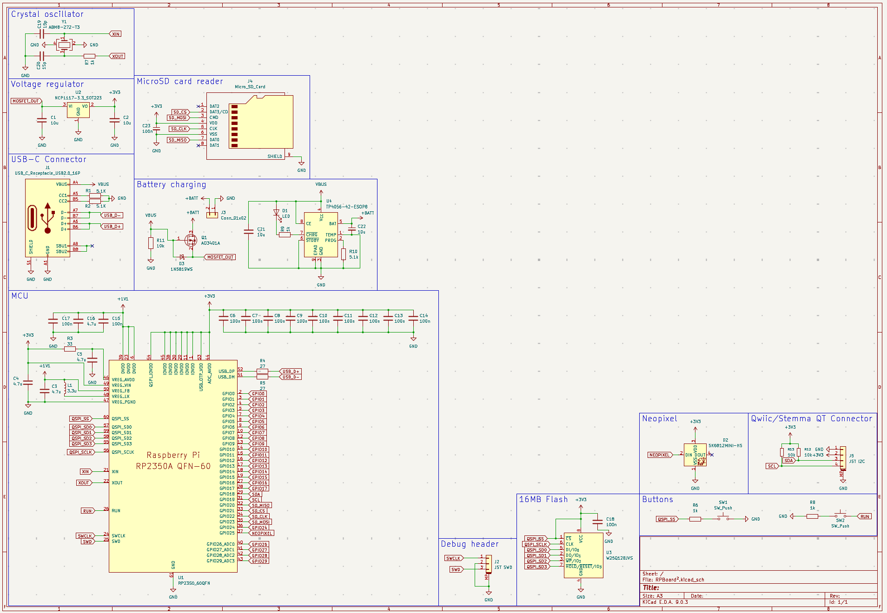
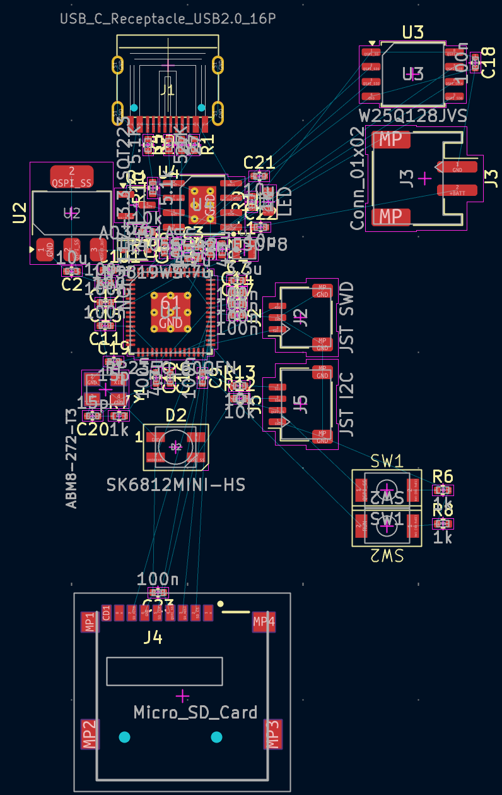
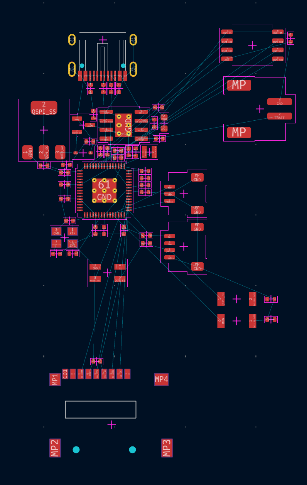
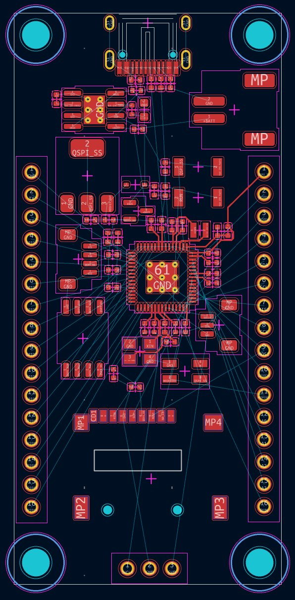
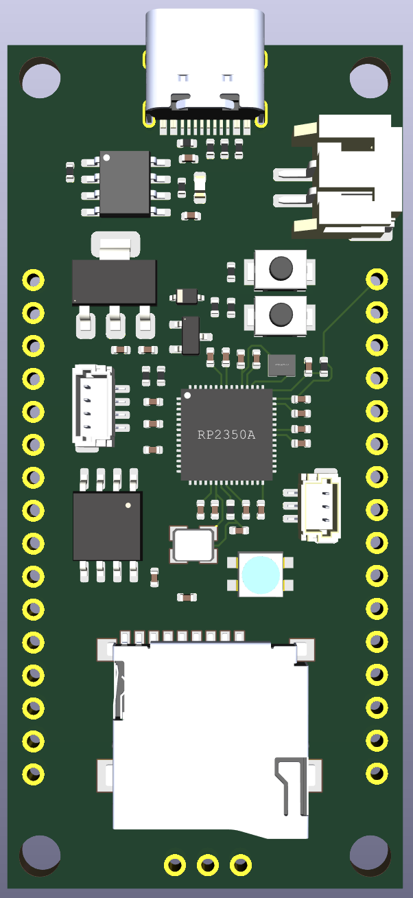
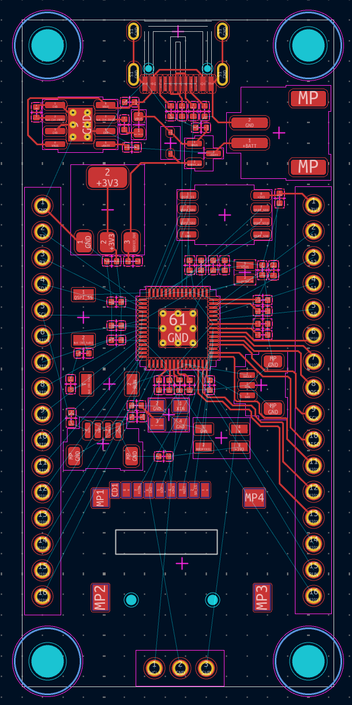
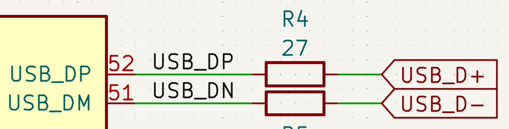
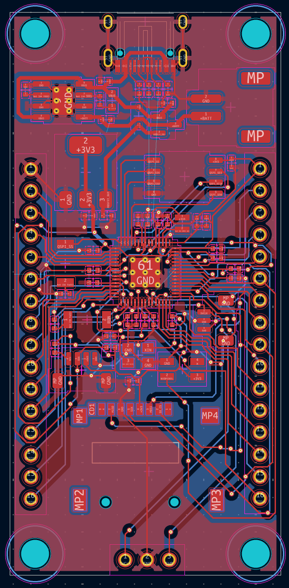

### Total time spent: 29h

# July 15: Started reading hardware design guide + basic schematic design

I wanted to get started doing the schematic as I was reading the guide instead of just reading, so that's what I did :D

Here's how my schematic is looking for now: (ik it's really basic but I'm just getting started and following the guide, I'll add a ton of features once I have the basics done. also I spent most of the time trying to understand what I'm doing instead of just copy pasting that's why it took me so long lol)

Only thing I changed for now is the USB connector for it to be USB-C, it's not really too different from the micro USB symbol but that's probably because I'm using a 16 pin connector.

As for the flash, it took me quite some time to figure out how to wire it because the guide wasn't really clear but it ended up being easier than I thought, idk why I got so confused lol

Then I also added decoupling caps on the power pins (took me some time to understand what they were and why I should add them but after quite a lot of googling I think I figured it out).

And the last thing I added to my schematic was the external components needed to make the on-chip voltage regulator work properly, I copied that from the guide since I didn't want to mess up and for some reason the guide really insists on using a specific inductor so might as well do that lmao

To finish with the basics of the schematic I'm only missing the crystal oscillator, a debug connector (optional but I'll add it anyways for convenience) and a reset button (optional too but obviously nice to have).

As for additional features, for now I'm planning on adding lipo battery support, a Qwiic connector, a microSD card slot and maybe even a small OLED depending on how much space I have left

Well hopefully tomorrow I'll finish with the basics and start adding some actually interesting features!! :D

**Time spent this session: 4h**

# July 16: Finished basic features + lot of research into charging circuit

Today I finished the basic features needed to make the board work! It's really simple though so I don't think its worth it to even include a screenshot of that.

What I did spend a lot of time on though is trying to figure out how I'd implement battery charging into the board, and after a few hours of googling and reading datasheets I think I'm gonna use a TP4056 with its "typical application" circuit as the charging IC (screenshot below) and then use a MOSFET so load switches to VBUS when USB is plugged in. From what I've seen I also have to include a diode in the load sharing circuit for protection. I'll try to add the charging aspect tomorrow and then see if someone can take a look at my schematic and tell me if there's any mistakes, maybe I'm overthinking this too much lol

microSD card reader shouldn't be too hard to wire, and a Qwiic connector should be even easier. I'm not sure if I'll end up adding the OLED though, since I'm planning on getting PCBA for this board and also aliexpress takes like 2 months to ship to me so I wouldn't be able to build it in time unless I source it locally (in that case I'd pay the price difference between getting it locally and ali out of pocket since the cost of locally sourcing an OLED is lower than the customs fees I'd be charged with aliexpress lmao)

Hopefully this approach works because I spent a lot of time figuring it out 😭

**Time spent this session: 3h**

# July 17: Finished charging circuit + tidied up schematic

I finally finished implementing the charging circuit in my schematic, it took me way longer than it should have but I wanted to make sure I was doing everything right becasue no power = no board :(

This is how my charging circuit looks now:

The 5.1k resistor should give me a charging current of around 200-250 mA, which I think is fine for small LiPo batteries. Anyways, if I were to change my mind later I could just swap that resistor.

I also switched the voltage regulator to take in the output from the MOSFET instead of just VBUS:

Finally, I tidied up the schematic, changed the size to A3 and divided everything into sections so it's easier to read and work with:

I think tomorrow I'll be able to fully finish my schematic and maybe start with the PCB, though I'd like to get someone to take a look at it and tell me if there are any obvious mistakes before starting with the PCB

**Time spent this session: 2h**

# July 18: Finished schematic + started assigning footprints

I finished the schematic today, added the microSD card reader (didn't know how to wire it at all, but I found a nice video that explained how SPI worked and I also found the RP2350 datasheet to find out what pins I had to use), a neopixel on pin 25 (if it makes assembly too hard / costly I might remove it) and a 4 pin Qwiic / Stemma QT connector.

This is how the schematic is looking as of now:

I also started looking for footprints and assigning them so I can already get started on the PCB. Though I'll probably wait for someone to take a look at it before starting, someone suggested I send it in the KiCad discord server so I'll probably do that (after creating a new account I haven't used discord in ages lol)

Hopefully I'm able to finish this board soon, though with the time it took me to make the schematic I don't expect the PCB to be any easier 😭

**Time spent this session: 2h**

# July 22: Got my schematic reviewed + started PCB

Today I finally sent my schematic to the KiCad discord server and someone helped me with it. First, they told me to specify the caps for the LDO because there are limits on ESR (will do), secondly, they told me to wire the TEMP pin of the TP4056 and not just ground it, but I can't really do that since afaik I'd need to use 3-wire LiPos with a thermistor so I'll just keep that pin grounded I guess lol

Then last thing they suggested is that I review the MOSFET circuit, but after chatting back and forth for a while I'm pretty sure it'll work, it's similar to a diode but without the voltage drop.

After all this, I assigned all footprints (had to make one myself for the push buttons but it's just two pads) and imported everything to the PCB editor. Then I started positioning and laying out the components on the board, it's still not done yet but this is how it's looking for now (focused on the decoupling capacitors, definitely not even close to finished yet):

And here's how it looks like with the silkscreen layer disabled:

I'll keep working on it, I don't think it should be too hard now but we'll see :pf:

**Time spent this session: 5h**

# July 24: Improved PCB layout, hopefully ready to route

Today I continued working on the PCB, and I think I finally have it sort of ready to route (might change the layout later if routing is too hard though). I assigned 3D models to every footprint, put everything together and also added through-holes for headers and mounting holes. Here's how the PCB is looking for now:

And here it is in the 3D viewer:

I'll fillet the corners and add a shit ton of silkscreen after finishing routing everything. Maybe I'll have to change the layout again when I realize everything's impossible to route though so we'll see :pf: (also I know for sure I'll change the headers layout because right now it's not ordered to match the MCU pins)

I also changed the footprint for the Stemma QT and debug connectors to be vertical so I can save space on that.

Now I guess I can just get started routing and hopefully finish the PCB soon!! I really want to finish it I've dedicated most of my free time to working on this :heavysob:

**Time spent this session: 4h**

# July 25: Started routing and changed layout (again)

I finally got onto routing the PCB today! I spent a lot of time moving stuff around and trying different positions, and I also changed the header pins connections to match the order of the physical MCU pins. I also realized the flash memory chip was not wired properly in my schematic, the CS pin was also wired to 3V3 (originally it was for an optional pull-up resistor, but I didn't realize if I didn't include the pull-up I also wouldn't need to wire it to 3V3 :pf:) but that was a quick fix, just removed the connection and updated the PCB.

After a few hours of routing, I sent my progress to the Slack and realized the MCU wasn't centered which I haven't really thought of before, so I moved some stuff to make space for the MCU and had to delete almost all the tracks I've routed :heavysob:

This is how the PCB is looking for now:

I'll add a ground pour on both layers when I finish routing, along with a fillet for the corners and silkscreen!! (what I'm looking forward to the most lol)

**Time spent this session: 4h**

# July 27: More routing (almost finished)!

Today I continued routing the PCB traces and added a ground pour on the front and back layers, I don't think I have much more to say about that lol

I also added a net label to the USB_DP and USB_DM pins of the MCU so KiCad lets me route a differential pair for the USB data lines, here's a screenshot of that in the schematic:

And here's a screenshot of how the PCB is looking for now:

I'm only missing 10 more routes and after that I should be finished with the PCB!! yayyy

Hopefully there aren't any big mistakes I didn't notice because if there are I am NOT gonna be able to submit before the deadline 😭

**Time spent this session: 5h**
