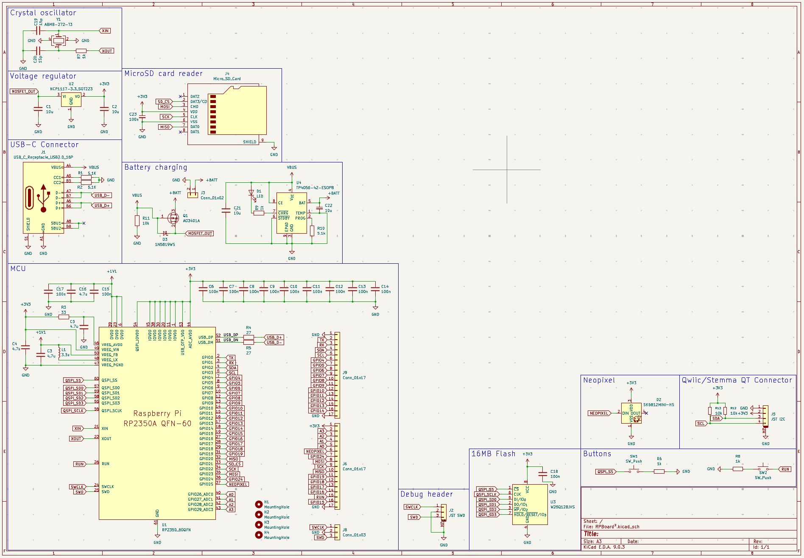
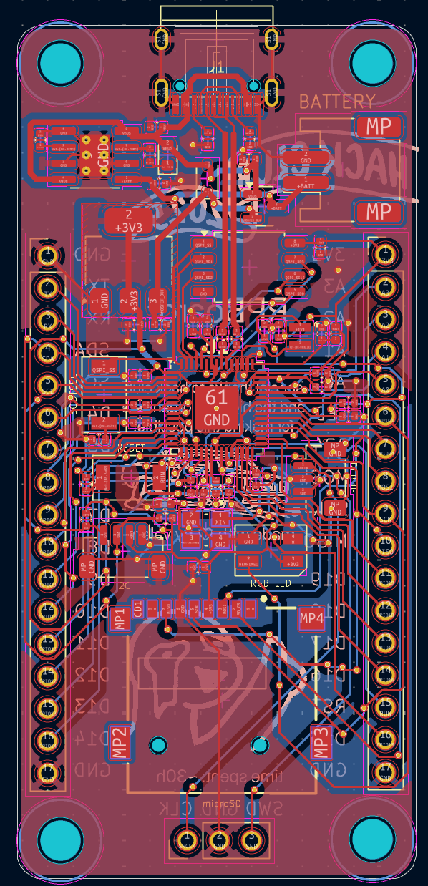
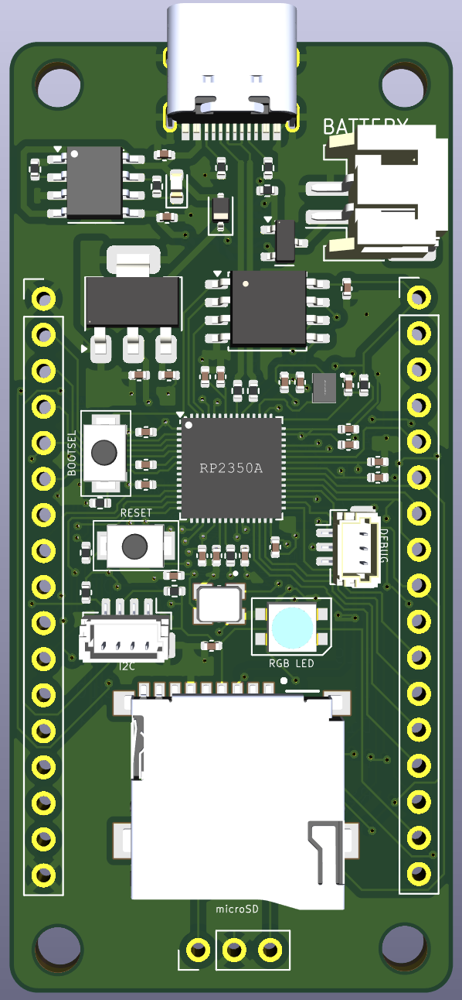

# RPBoard²

RPBoard² is a simple RP2350-based board with multiple convenient features built-in. It's my first "actual" PCB project (I only did a hackpad before)

## Motivation

I wanted to build a devboard to learn more about actual PCB design and electronics, instead of using pre-made boards. I considered it as a personal challenge and ended up learning a lot on the two weeks it took me to make it :D

## Features:

- RP2350A MCU
- JST Debug header
- Built-in lithium battery support
- microSD card reader
- On-board RGB LED on GPIO25 (neopixel)
- QWIIC / Stemma QT I2C connector
- USB-C connector
- 16MB flash memory

## PCB and schematic:

### Schematic:

### PCB:

| PCB editor                                    | 3D viewer                                        |
| --------------------------------------------- | ------------------------------------------------ |
|  |  |

Both the PCB and the schematic were designed using KiCad. The PCB is a 2-layer board with a ground pour on both layers.

## BOM:

| Name                             | Description                                                                                                                                            | Quantity | LCSC Part # | Total price |
| -------------------------------- | ------------------------------------------------------------------------------------------------------------------------------------------------------ | -------- | ----------- | ----------- |
| CL05A106MP5NUNC                  | 10V 10uF X5R ±20% 0402 Multilayer Ceramic Capacitors MLCC - SMD/SMT ROHS                                                                               | 4        | C315248     | $0.1640     |
| CGA0402X7R104K160GT              | 16V 100nF X7R ±10% 0402 Multilayer Ceramic Capacitors MLCC - SMD/SMT ROHS                                                                              | 13       | C6119799    | $0.0342     |
| CL05A475MP5NRNC                  | 10V 4.7uF X5R ±20% 0402 Multilayer Ceramic Capacitors MLCC - SMD/SMT ROHS                                                                              | 4        | C23733      | $0.0384     |
| CC0402JRNPO9BN150                | 50V 15pF NP0 ±5% 0402 Multilayer Ceramic Capacitors MLCC - SMD/SMT ROHS                                                                                | 2        | C106997     | $0.0220     |
| XL-1608SURC-06                   | 20mA 225mcd Water Clear op View Mount 620nm~630nm Red 120° 50mW 2.3V 0603 LED Indication - Discrete ROHS                                               | 1        | C965799     | $0.0620     |
| SK6812MINI-HS                    | SMD,3.5x3.7mm RGB LEDs(Built-in IC) ROHS                                                                                                               | 1        | C2922787    | $0.4665     |
| 1N5819WS                         | 40V 600mV@1A 1A SOD-323 Schottky Diodes ROHS                                                                                                           | 1        | C191023     | $0.0192     |
| TYPE-C-31-M-12                   | 5A 1 16P Female Type-C SMD USB Connectors ROHS                                                                                                         | 1        | C165948     | $0.3394     |
| BM03B-SRSS-TB(LF)(SN)            | 1x3P 3P SH Tin 3 -25℃~+85℃ 1A 1 1mm Copper Alloy Surface Mount,Vertical SMD,P=1mm Wire To Board Connector ROHS                                         | 1        | C160389     | $1.1070     |
| S2B-PH-SM4-TB(LF)(SN)            | 1x2P 2P PH Tin 2 -25℃~+85℃ 2A 1 2mm Copper Alloy Surface Mount, Right Angle SMD,P=2mm,Surface Mount,Right Angle Wire To Board Connector ROHS           | 1        | C295747     | $0.9295     |
| TF-01A                           | 1.85mm Connector and Ejector MicroSD Card (TF Card) Push-Push SMD SD Card / Memory Card Connector ROHS                                                 | 1        | C91145      | $0.3372     |
| BM04B-SRSS-TB(LF)(SN)            | 1x4P 4P SH Tin 4 -25℃~+85℃ 1A 1 1mm Copper Alloy Surface Mount,Vertical SMD,P=1mm Wire To Board Connector ROHS                                         | 1        | C160390     | $0.9105     |
| AOTA-B201610S3R3-101-T           | 0806 Power Inductors ROHS                                                                                                                              | 1        | C42411119   | $1.3680     |
| AO3401A                          | 30V 4.2A 120mΩ@2.5V 1.4W 1.3V@250uA 1 P-Channel SOT-23 MOSFETs ROHS                                                                                    | 1        | C347476     | $0.2990     |
| 0402WGF5101TCE                   | 62.5mW Thick Film Resistor 50V ±100ppm/℃ ±1% 5.1kΩ 0402 Chip Resistor - Surface Mount ROHS                                                             | 3        | C25905      | $0.0030     |
| 0402WGF1002TCE                   | 62.5mW Thick Film Resistor 50V ±100ppm/℃ ±1% 10kΩ 0402 Chip Resistor - Surface Mount ROHS                                                              | 3        | C25744      | $0.0030     |
| 0402WGF330JTCE                   | 62.5mW Thick Film Resistor 50V ±100ppm/℃ ±1% 33Ω 0402 Chip Resistor - Surface Mount ROHS                                                               | 1        | C25105      | $0.0010     |
| RC0402FR-0727RL                  | 62.5mW Thick Film Resistor 50V ±100ppm/℃ ±1% 27Ω 0402 Chip Resistor - Surface Mount ROHS                                                               | 2        | C138021     | $0.0120     |
| FRC0402J102 TS                   | 62.5mW Thick Film Resistor 50V ±100ppm/℃ ±5% 1kΩ 0402 Chip Resistor - Surface Mount ROHS                                                               | 4        | C2906899    | $0.0080     |
| TS-1088-AR02016                  | Without Bracket 50mA 4mm 100,000 Cycles 12V 1.6N 3mm 2mm Round Button Surface Mount,Vertical SPST SMD Tactile Switches ROHS                            | 2        | C720477     | $0.1692     |
| RP2350A                          | QFN-60-EP(7x7) Microcontrollers (MCU/MPU/SOC) ROHS                                                                                                     | 1        | C42411118   | $2.1330     |
| NCP1117ST33T3G                   | 62dB@(120Hz) 1A Fixed 3.3V Positive 20V SOT-223 Voltage Regulators - Linear, Low Drop Out (LDO) Regulators ROHS                                        | 1        | C26537      | $0.5098     |
| W25Q128JVSIQ                     | 128Mbit SPI 133MHz SOIC-8-208mil NOR FLASH ROHS                                                                                                        | 1        | C97521      | $1.9590     |
| TP4056-42-ESOP8                  | 4V~8V Lithium-ion/Polymer 1 1A ESOP-8 Battery Management ROHS                                                                                          | 1        | C16581      | $0.3438     |
| ABM8-272-T3                      | SMD3225-4P Crystals ROHS                                                                                                                               | 1        | C20625731   | $2.1000     |
| PCB Price                        | JLCPCB                                                                                                                                                 | 5        | N/A         | $2.00       |
| Economic PCBA setup fee          | JLCPCB                                                                                                                                                 | N/A      | N/A         | $8.00       |
| PCBA stencil                     | JLCPCB                                                                                                                                                 | N/A      | N/A         | $1.50       |
| Extended components fee          | JLCPCB                                                                                                                                                 | N/A      | N/A         | $51.00      |
| SMT assembly                     | JLCPCB                                                                                                                                                 | N/A      | N/A         | $1.13       |
| Special components fee           | JLCPCB                                                                                                                                                 | N/A      | N/A         | $0.06       |
| Nitrogen reflow soldering        | JLCPCB                                                                                                                                                 | N/A      | N/A         | $0.82       |
| Shipping to Argentina (cheapest) | DHL Express (FedEx appears to be cheaper on cart page but adds an additional remote area surcharge at checkout, DHL ends up being the cheapest option) | N/A      | N/A         | $33.33      |
| Subtotal                         | N/A                                                                                                                                                    | N/A      | N/A         | $111.18     |
| Total after $80 JLCPCB coupon    | N/A                                                                                                                                                    | N/A      | N/A         | $31.18      |

Although DHL shipping is expensive, it's the cheapest option for Argentina. FedEx has a cheaper price in the cart page, but after checking out it adds a $50+ remote area surcharge.

## Special thanks:

Thanks to Hack Club and the highway organizing team for all their efforts to make this possible. I would have never thought I'd be capable of something like this, yet highway gave me the motivation I needed to actually learn and design, and the funding to make it real.
